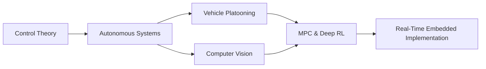

<div align="center">

# 🚀 Zakaria Jouhari

### Embedded Systems Engineer | Control Systems Specialist | Robotics Enthusiast

[](https://www.linkedin.com/in/zakaria-jouhari-77aa971a8)
[](mailto:jouhari.zakaria@uit.ac.ma)
[](https://www.ensa.ac.ma)

</div>

---

## 🎯 About Me

```python
class EmbeddedEngineer:
    def __init__(self):
        self.name = "Zakaria Jouhari"
        self.role = "Embedded Systems Engineering Student"
        self.location = "Morocco 🇲🇦"
        self.education = "ENSA Kenitra - 5th Year"
        self.interests = ["Autonomous Vehicles", "Control Theory", "Robotics", "Computer Vision"]
        
    def current_focus(self):
        return [
            "Model Predictive Control for Vehicle Platooning",
            "Deep Reinforcement Learning in Automotive Systems",
            "Real-Time Embedded Applications",
            "SLAM & Autonomous Navigation"
        ]
```

## 🛠️ Tech Arsenal

<div align="center">

### Languages & Frameworks


### Embedded Systems & Hardware


### Robotics & AI


### Tools & Platforms


</div>

## 🏆 Featured Projects

<div align="center">

| Project | Description | Tech Stack |
|---------|-------------|------------|
| 🤖 **[JetGuard](https://github.com/Zakariajouhari1/JetGuard-Road-Following-and-Collision-Avoidance)** | Autonomous navigation robot with SLAM & real-time obstacle avoidance | Jetson Nano, ROS, Python, Computer Vision |
| 🕳️ **[Pothole Detection](https://github.com/Zakariajouhari1/Pothole-Detection-apps-using-yolo-v4)** | YOLOv4-based detection system with 90% accuracy on edge devices | YOLOv4, Raspberry Pi, OpenCV, Darknet |
| 🎯 **Active Stabilization System** | ESP32-based fin stabilization with Kalman filtering & PID control | ESP32, MPU6050, Firebase, JavaFX |
| 🚗 **Vehicle Platooning** | MPC & DDPG algorithms for adaptive convoy control | Python, SUMO, ns-3, C++ |

</div>

## 📊 GitHub Stats

<div align="center">


</div>

## 💼 Professional Experience

```yaml
Research_Intern:
  company: "TICLab @ Université Internationale de Rabat"
  period: "June - Sept 2025"
  highlights:
    - "Developed MPC controllers for automotive platooning in Python/SUMO"
    - "Implemented DDPG algorithms for adaptive convoy control"
    - "Co-authored research paper on Communication-Aware DDPG (publication 2026)"
    
Engineering_Intern:
  company: "Redal - Electric Distribution Company"
  period: "July - Aug 2024"
  highlights:
    - "Designed STM32-based PCB with MPU6050 using Altium Designer"
    - "Developed vibration monitoring system for rotating machines"
    - "Implemented predictive maintenance algorithms in C/C++"
```

## 🎖️ Achievements

- 🥈 **2nd Place National** - Plasma Vortex ENSAK Sumobot Competition 2024
- 📝 **Co-Author** - Research paper on Communication-Aware DDPG for platooning (upcoming)
- 🤝 **Team Lead** - Led 8-member robotics team for autonomous vehicle development
- 🎓 **Mentor** - US Embassy Edukathon program (50+ high school students)

## 📈 Current Focus



## 💡 Interests & Expertise

<div align="center">

| Domain | Technologies |
|--------|-------------|
| 🎛️ **Control Systems** | MPC, PID, Kalman Filter, State-Space, LQR |
| 🤖 **Robotics** | SLAM, Path Planning, Sensor Fusion, ROS |
| 👁️ **Computer Vision** | YOLO, TensorRT, OpenCV, Image Processing |
| 🔌 **Embedded Systems** | RTOS, DMA, Interrupts, Communication Protocols |
| 📡 **IoT & Connectivity** | MQTT, CAN, LIN, UART, SPI, I²C |

</div>

## 🌐 Let's Connect

<div align="center">

[](https://www.linkedin.com/in/zakaria-jouhari-77aa971a8)
[](mailto:jouhari.zakaria@uit.ac.ma)
[](https://github.com/Zakariajouhari1)

</div>

---

<div align="center">

### 💭 Quote of the Day


### 👀 Profile Views


**⚡ "Building intelligent systems, one line of code at a time"**

</div>
